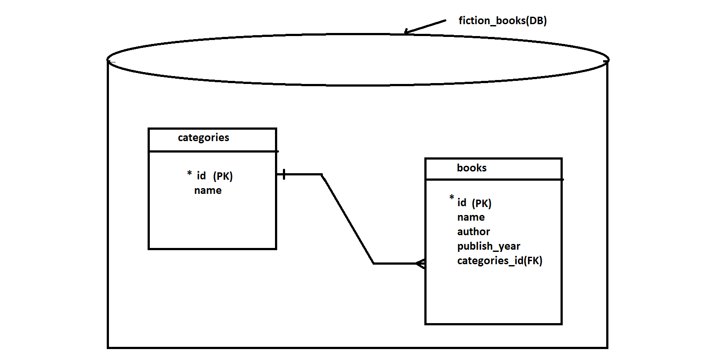
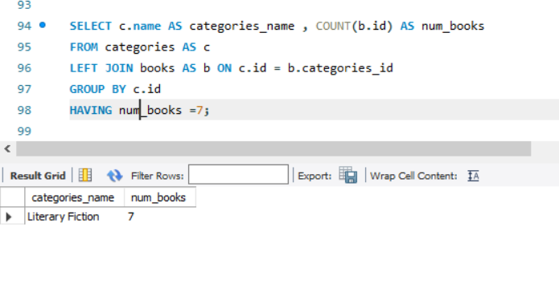

# FICTION_BOOKS_DB-SQL-PROJECT

1.About Project

====================

FICTION_BOOKS_DB: A  SQL project to Learn and Understand 

•	SQL CURD Operations 

•	PRIMARY KEY & FOREIGN KEY

•	AGGREATE FUNCTIONS

•	JOINS AND FILTERS (COMPLEX QUERIES)

2.Install MySql server & workbench and connect them together

==============================================================

links to install:
•	Windows Install Wizard: http://bit.ly/2DB2T6D   
	After installation you can see the window below and start the project
	
	

 
 3.Let’s Start
 
 ==============

It is Begin with creating a  Database called fiction_books and creating two tables named Categories, Books inside it 

•	Categories table includes id column (primary key) and name column with 3 category names of fiction books

•	Books table includes columns id (primary key), name (name of the book), author, publish_year, categories_id (foreign key : referring id column in  categories table)

4. CURD Operations(Create,Update,Read,Delete)

===================================================

You can see the complete List of commands/queries for CURD Operations  in the queries.txt file

To see Queries go to: https://github.com/Roselin-Joseph/FICTION_BOOKS_DB-SQL-PROJECT/blob/main/queries.txt

Image shows queries to create database and tables

Output Images of tables Created

	

5.AGGREGATE FUNCTIONS,JOIN , GROUP BY AND HAVING 

In the queries.txt file You can see a lot of queries in this section

To see goto: To see go to: https://github.com/Roselin-Joseph/FICTION_BOOKS_DB-SQL-PROJECT/blob/main/queries.txt 
 
One example query is shown below

To see more output Images goto: https://github.com/Roselin-Joseph/FICTION_BOOKS_DB-SQL-PROJECT/blob/main/images

Thank You!

 

                         -
    
